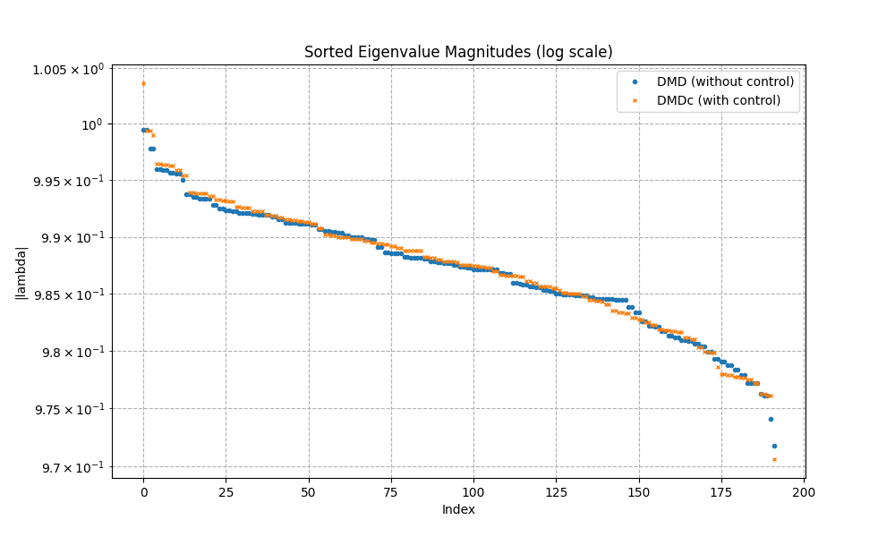

# Continuous-Time Predictors for JEPA World Models

[](https://www.python.org/downloads/)
[](https://pytorch.org/)
[](LICENSE)

Does making a world model's predictor continuous in time make it better? We replace the transformer predictor of **[LeWorldModel (LeWM)](https://arxiv.org/abs/2603.19312)** with an **ODE-ViT** — a learned vector field $\dot z = f_\theta(z, a)$ — and test it on PushT with everything else held fixed.

**Short answer: no — and theory says it shouldn't.** The continuous predictor matches the discrete one, both on a frozen encoder and when trained end-to-end from pixels. What matters is how the predictor is trained and how the planner searches, not whether time is continuous.

<p align="center">
  
</p>

---

## Findings

### 1. No accuracy advantage
- **Frozen LeWM encoder:** The ODE-ViT reaches **90.0%** vs **87.75%** for LeWM's predictor ($n=400$, $p=0.30$) while using **4.8× fewer parameters** (2.25M vs 10.79M) and strictly **Markovian 1-frame context** (vs 3-frame history). At matched width, continuous and discrete score identically (**181/200** each, $p=1.00$).
- **End-to-end from pixels:** After reproducing LeWM's official checkpoint (**84.5% vs 82.0%**, $p=0.50$), we swap in the ODE predictor with matched depth, history and conditioning. There is no statistically significant difference at any checkpoint from epoch 10 to 100 ($n=200$ paired, all $p > 0.20$).

<p align="center">
  
  <br><em>What p = 0.38 looks like: the 200 paired episodes at epoch 100.</em>
</p>

### 2. Parity is the expected result
With actions held constant over each control step (zero-order hold), the continuous flow over one step is a discrete transition map:

$$z_{k+1} = \Phi_h^{f(\cdot, u_k)}(z_k) \quad \text{exactly.}$$

At a fixed control rate, the two are observationally equivalent at every sample time. The learned field is also nearly straight within a step (path is 99.5% straight, arc/chord ratio $= 1.005$, velocity rotates only $\sim 16^\circ$), so a **single Euler step ($N=1$) is enough** — more integration steps change nothing.

### 3. The training recipe matters more than the parameterization
Supervising multi-step rollouts instead of single steps raised success from **20% to 74%** at the same model size (972K params, $n=50$). A ~2.25M-parameter predictor, continuous or discrete, matches LeWM's 10.8M one.

### 4. Gradient-based planning can be rescued — but CEM is hard to beat
- **Graduated Non-Convexity (GNC):** Smoothing the learned dynamics and annealing the smoothing to zero ($\sigma: 0.4 \to 0$) lifts gradient-based collocation from **19.0% to 57.0%** on the continuous model ($p \approx 5 \times 10^{-22}$) and from **16.5% to 51.0%** on the discrete model ($p \approx 6 \times 10^{-20}$).
- **Ensemble Kalman Inversion (EKI):** A derivative-free ensemble Kalman planner works without gradients (58.5%), and a hybrid CEM-EKI resolves multimodality (82.5%), but neither shifts the frontier beyond a well-tuned CEM.

### 5. CEM's default search budget is larger than needed
On the checkpoint tested, **2,000 rollouts per replan match the default 9,000** (**85.0% vs 84.5%**, $p = 1.00$) in a third of the time ($0.33\text{ s}$ vs $1.06\text{ s}$ per episode).

<p align="center">
  
  <br><em>Scaling frontier: CEM reaches 85% at 2,000 rollouts; the Hybrid CEM-EKI curve merges with standard CEM.</em>
</p>

### 6. Careless evaluation creates fake wins
With an unseeded planner and 50 episodes, the continuous model appeared 14 points better (96% vs 82%). With deterministic per-environment seeding and 200 paired episodes, the gap completely disappeared ($p = 0.38$).

<p align="center">
  
</p>

---

## Why Planners Plateau

The encoder does capture the physical state: a linear probe recovers pusher and block pose with $R^2 \approx 0.94$. But the planning cost — latent distance to the goal image $\| \hat z - z_{\text{goal}} \|^2$ — mostly tracks the pusher, not the block, because the pusher moves 36–54× more between frames.

Latent distance to the goal correlates strongly with the pusher's distance to its goal ($\rho \approx 0.39$), but barely with the block's ($\rho \approx 0.08$). The cost largely asks *"is the pusher where it is in the goal image?"* rather than *"is the block in place?"*. This explains why every planner we tested plateaus around 85–87%.

<p align="center">
  
</p>

---

## What Didn't Work

Negative results, each with the underlying measurement:

- **Predicting between frames:** No better than a straight line between the endpoints — even an oracle given both endpoints and all actions couldn't beat linear interpolation.
- **Finding timescale structure in latent dynamics (Koopman / DMD):** The linear fit is close to identity (residual 0.92), with eigenvalues bunched at 0.97–1.0 and no separation of timescales.
- **Straightening frozen latents after the fact:** A linear map plateaus at $\cos \approx 0.68$ regardless of regularizer weight ($\lambda = 1, 10, 100$); a nonlinear map collapses.
- **Structural variants:** Control-affine dynamics ($\dot z = f(z) + g(z)a$, $-8$ points), momentum input ($\Delta z$, $-8$ points), and dropout ($-5$ points) all lowered success.
- **Learned planning cost:** Accurately ranks real states, but the planner exploits it in out-of-distribution states (collapsing to 2% success).
- **Regularizing rollout drift:** Noise injection and manifold penalties showed no measurable benefit on planning.

<p align="center">
  
  <br><em>Koopman eigenvalue spectrum: eigenvalues bunch near 1.0 without spectral gaps or timescale separation.</em>
</p>

---

## Evaluation Protocol

- **Task:** PushT (`swm/PushT-v1`), goal 25 steps ahead, 50-step budget, frameskip 5.
- **Default Planner:** CEM, 300 samples × 30 iterations (or calibrated 100 × 20), horizon 5 blocks.
- **Statistical Rigor:** All comparisons are paired (exact same episodes for both models), evaluated with two-tailed exact McNemar tests on discordant pairs and 95% Wilson score confidence intervals.
- **Reproducibility:** Evaluated with independent per-environment random streams, decoupling batch size from RNG state. Re-running a checkpoint reproduces its score exactly. Per-episode binary outcomes behind every number are committed in `results/`.

---

## Repository Structure

```text
continuous-lewm/
├── cwm/
│   ├── models/           # ODE-ViT velocity predictor, discrete predictor, encoders
│   ├── solvers/          # cem.py, collocation.py (augmented Lagrangian), gnc.py,
│   │                     # ensemble_kalman.py (EKI + hybrid)
│   ├── eval/             # deterministic paired evaluator (per-environment streams)
│   └── analysis/         # statistics (McNemar, Wilson intervals)
├── configs/              # model, solver, and task configs
├── scripts/
│   ├── make_figures.py   # reproduces all markdown tables & figures in seconds
│   └── generate_readme_figures.py # generates all high-DPI README plots
├── results/              # per-episode outcome JSONs for all 24+ configurations
└── assets/figures/       # high-resolution figures used in this README
```

---

## Reproducing the Results

```bash
git clone https://github.com/marc-herrero/continuous-lewm.git && cd continuous-lewm
conda env create -f environment.yml && conda activate cwm

# Recompute every table, confidence interval, and p-value in seconds:
python scripts/make_figures.py --results results/

# Regenerate all README publication figures:
python scripts/generate_readme_figures.py
```

---

## Limitations

1. **One task:** PushT has a fixed control rate and regular sampling — exactly where theory predicts no difference. Settings where a continuous model could differ, such as irregular timestamps or changing control rates, are not tested here.
2. **Checkpoint scope:** The planning budget curve comes from the official LeWM checkpoint and discrete reproduction.

---

## Acknowledgements

Built on **[LeWorldModel](https://arxiv.org/abs/2603.19312)** and the `stable-worldmodel` library, with the PushT dataset from **[DINO-WM](https://arxiv.org/abs/2411.04983)**. The planning work draws on randomized smoothing through contact ([Suh, Pang & Tedrake](https://arxiv.org/abs/2109.05143)) and ensemble Kalman inversion ([Iglesias, Law & Stuart](https://arxiv.org/abs/1302.3585)). See **[Temporal Straightening for Latent Planning](https://arxiv.org/abs/2603.12231)** (Wang et al., ICML 2026) for related work on latent geometry.

```bibtex
@misc{herrero2026continuouslewm,
  title = {Continuous-Time Predictors for JEPA World Models},
  author = {Herrero, M.},
  year = {2026},
  note = {Bachelor's Thesis, Computer Vision Center (CVC)},
  url = {https://github.com/marc-herrero/continuous-lewm}
}
```

## License
MIT License. See [LICENSE](LICENSE) for details.
