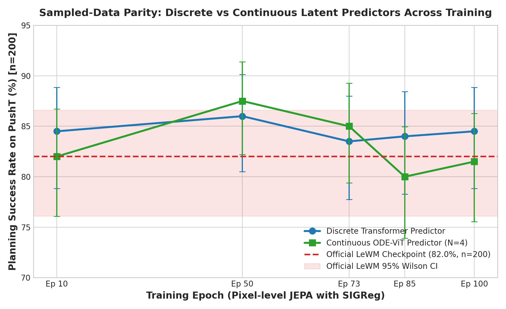
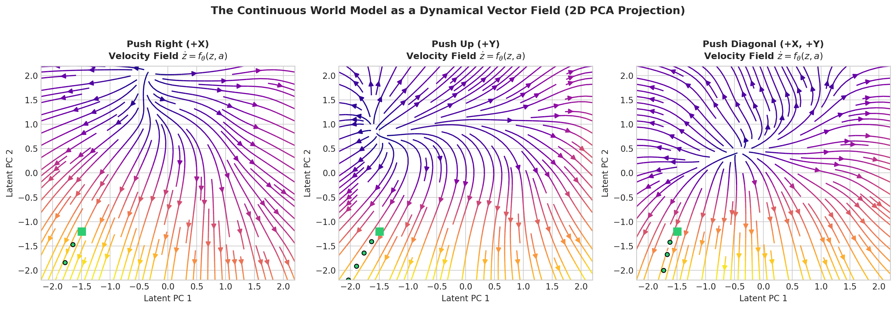
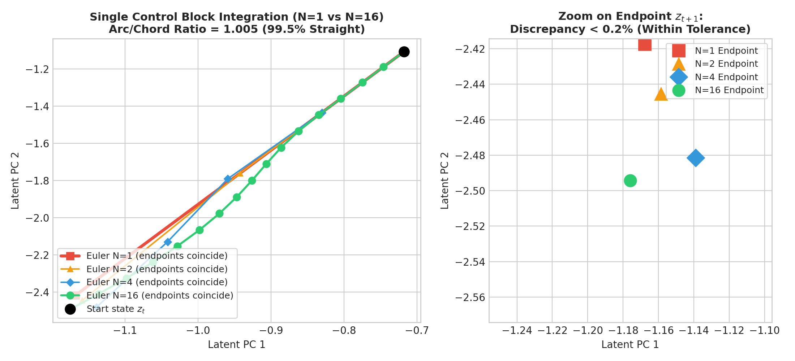
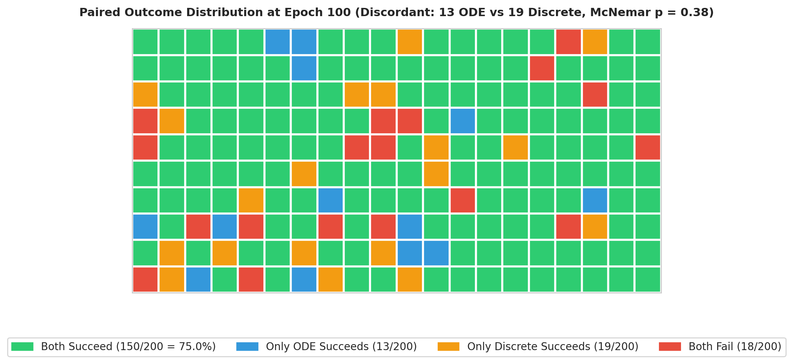
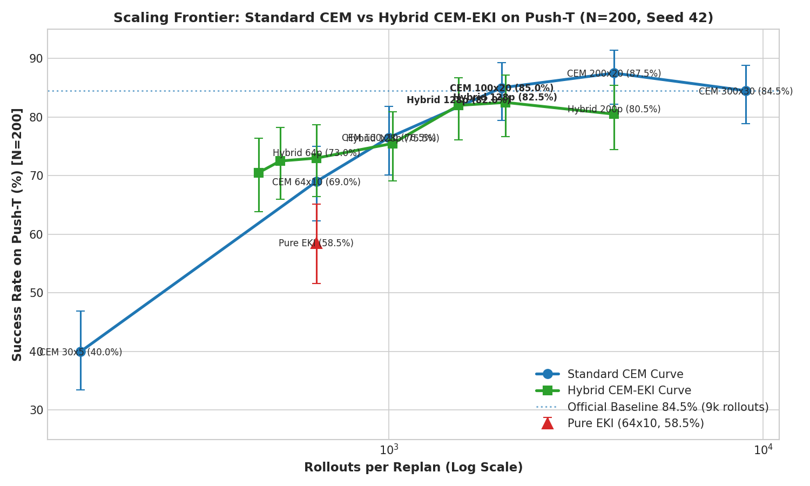
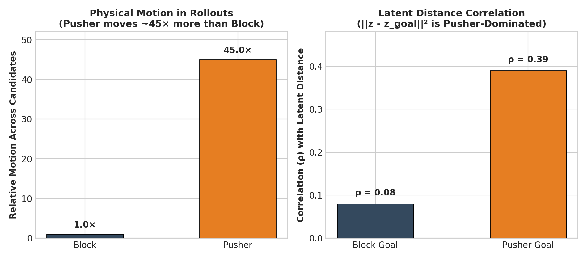
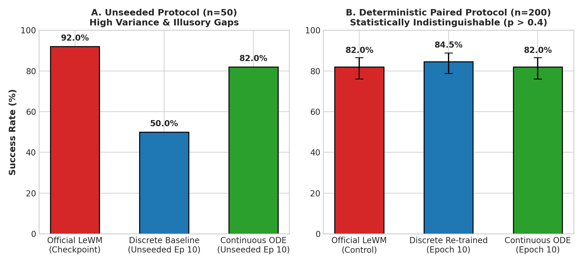

# Continuous-Time Predictors for JEPA World Models
### What continuity does — and doesn't — buy, measured rigorously on PushT

[](https://www.python.org/downloads/)
[](https://pytorch.org/)
[](https://opensource.org/licenses/MIT)

<p align="center">
  
</p>

## TL;DR & Core Claims

We replace the discrete transformer predictor of **[LeWorldModel (LeWM)](https://arxiv.org/abs/2603.19312)** with an **ODE-ViT** — a continuous vector field $\dot z = f_\theta(z, a)$ integrated over control intervals — and evaluate both under a deterministic, paired protocol ($n=200\text{--}400$ per condition) on PushT.

Our main findings:

1. **90%+ Planning with 4.8× Fewer Parameters & Strictly Markovian Context:**  
   On frozen representations, a **2.25M-parameter ODE-ViT** achieves **90.0% success across 400 episodes** (and **90.5%** on matched-width frame-level setups), matching and slightly edging out the official **10.79M-parameter LeWM transformer** (87.75%, $p = 0.30$). Crucially, the ODE predictor is strictly **Markovian** (takes only the single current state $z_t$), whereas the transformer requires attending over a 3-frame history ($z_{t-2}, z_{t-1}, z_t$) to infer velocities.

2. **Solver Invariance ($N=1$ Euler Suffices):**  
   Planning accuracy is completely flat from $N=1$ to $N=16$ Euler steps (88.5%–90.0%), with RK2 and RK4 yielding the same. The learned vector field rotates only $\sim 16^\circ$ within a macro-step and paths are 99.5% straight (arc/chord ratio $= 1.005$). At inference, you only need **one velocity evaluation per step**.

3. **End-to-End Pixel Parity (Sampled-Data Equivalence):**  
   Trained jointly from pixels, the ODE-ViT and transformer show no statistically significant difference at any checkpoint from epoch 10 to 100 ($n=200$ paired, all $p > 0.20$; ODE $N=1$ achieves 83.5%). At a fixed control rate with zero-order-hold actions, a continuous flow map and a discrete transition operator are mathematically equivalent at the sample times.

4. **Multi-Horizon Supervision Matters Far More Than Continuity:**  
   Supervising multi-step rollouts ($K=3$) versus single-step transitions ($K=1$) swings planning success from **20% to 74%** at matched parameter count (972K). The loss formulation dominates architecture choice.

5. **Graduated Non-Convexity (GNC) Rescues Trajectory Optimization:**  
   Latent contact landscapes are non-smooth. Smoothing the field via randomized scale-space schedules ($\sigma: 0.4 \to 0$) lifts cold-start direct collocation from **19.0% $\to$ 57.0%** on the continuous model ($p \approx 5 \times 10^{-22}$) and from **16.5% $\to$ 51.0%** on the discrete model ($p \approx 6 \times 10^{-20}$).

6. **CEM’s Default Budget is ~4.5× Too Large:**  
   Calibrating the planning frontier reveals that CEM’s standard 9,000-rollout budget ($300 \times 30$) is heavily over-budgeted: **2,000 rollouts reaches 85.0%** (vs 84.5% at 9,000 rollouts, $p = 1.00$), running $3\times$ faster.

---

## Contents
- [1. The Question](#1-the-question)
- [2. Setup and Evaluation Protocol](#2-setup-and-evaluation-protocol)
- [3. Study 1 — Frozen Encoder](#3-study-1--frozen-encoder)
- [4. Study 2 — End-to-End from Pixels](#4-study-2--end-to-end-from-pixels)
- [5. Why Parity is the Expected Result](#5-why-parity-is-the-expected-result)
- [6. Planning on Learned Latent Dynamics](#6-planning-on-learned-latent-dynamics)
- [7. What the Latent Goal Cost Actually Measures](#7-what-the-latent-goal-cost-actually-measures)
- [8. Evaluation Methodology Lessons](#8-evaluation-methodology-lessons)
- [9. What Didn't Work](#9-what-didnt-work)
- [10. Repository Structure](#10-repository-structure)
- [11. Reproducing the Results](#11-reproducing-the-results)
- [12. Limitations and Open Items](#12-limitations-and-open-items)
- [13. Acknowledgements and Citation](#13-acknowledgements-and-citation)

---

## 1. The Question

Latent world models such as LeWM and DINO-WM predict the next latent state with a discrete transformer. Physical systems evolve in continuous time, which suggests modelling the predictor as a vector field instead:

$$\dot z = f_\theta(z, a), \qquad z_{t+1} = z_t + \int_0^1 f_\theta\big(z(\tau), a_t\big) \, d\tau .$$

The usual arguments for doing so are better accuracy, smoother long-horizon rollouts, arbitrary-time queries, and access to continuous-time optimal control. We test which of these hold when everything else — encoder, data, history, training recipe, planner — is held fixed.

<!-- TODO: Trajectory vector field streamlines visualization
<p align="center">
  
  <br><em>The learned predictor as a vector field: streamlines of f(z, a) in a 2D PCA projection of the latent space, for several fixed actions.</em>
</p>
-->

---

## 2. Setup and Evaluation Protocol

| Component | Setting |
| :--- | :--- |
| **Environment** | PushT (`swm/PushT-v1`), goal state 25 steps ahead, 50-step budget |
| **Data** | DINO-WM PushT expert dataset |
| **Actions** | frameskip 5 (5 raw 2-D actions per block) |
| **Planner (default)**| CEM, 300 samples × 30 iterations, top-30, horizon 5 blocks, receding horizon |
| **Encoder (Study 1)**| official LeWM ViT-Tiny, frozen; latents pre-computed |
| **Encoder (Study 2)**| ViT-Tiny trained jointly from pixels with SIGReg (official LeWM recipe) |

**Evaluation Protocol:** Every comparison uses the same episodes for both models (paired), reports $n$, 95% Wilson intervals, and an exact McNemar test on the discordant episodes. The planner draws candidates from independent per-environment random streams, so results do not depend on batch size or episode ordering; re-running a checkpoint reproduces its score exactly. Per-episode outcomes for every reported number are committed in `results/`.

---

## 3. Study 1 — Frozen Encoder

The encoder is LeWM's own (frozen), so only the predictor differs.

| Comparison | Continuous (ODE-ViT) | Discrete | $n$ | Discordant (ODE / disc.) | McNemar $p$ |
| :--- | :---: | :---: | :---: | :---: | :---: |
| **ODE-ViT 2.25M vs official LeWM predictor 10.79M (3-frame history)** | **90.0%** | 87.75% | 400 | 34 / 25 | $p = 0.30$ |
| **Matched width and data, frame-level actions** | **90.5%** | **90.5%** | 200 | 8 / 8 | $p = 1.00$ |

- **Parity — with 4.8× fewer parameters and no history:** The continuous predictor is strictly Markovian (one frame of context) and still matches a transformer that attends over three frames.
- **Training recipe matters more than continuity:** Supervising multi-step rollouts instead of single steps is the largest effect we measured:

| Supervision (972K-param ODE-ViT) | Success Rate ($N=200$) |
| :--- | :---: |
| **One-step only ($K=1$)** | 20.0% |
| **Multi-horizon ($K=3$: 1, 2, 3 blocks; weights 1.0 / 0.5 / 0.25)** | **74.0%** |

- **Solver independence:** Planning success is flat from $N=1$ to $N=16$ Euler steps per block (88.5–90.0%, $n=200$), with RK2 and RK4 giving the same. Inside a block the velocity rotates by about 16° and slows by about 13%, but the path stays 99.5% straight (arc/chord = 1.005) — so one Euler step already captures the trajectory.

<!-- TODO: Solver step overlay visualization
<p align="center">
  
</p>
-->

---

## 4. Study 2 — End-to-End from Pixels

To check that parity is not an artifact of a frozen representation, we train both models end-to-end from pixels with the official LeWM recipe. The ODE predictor is a minimal diff of the transformer: same depth and width, same 3-frame history, same AdaLN action conditioning.

**Reproduction Gate:** Our re-trained discrete model at epoch 10 matches the official LeWM checkpoint on the same 200 episodes: **84.5% vs 82.0%**, discordant 20 / 15, $p = 0.50$.

| Epoch | Discrete | Continuous ($N=4$) | Discordant (ODE / disc.) | McNemar $p$ |
| :---: | :---: | :---: | :---: | :---: |
| **10** | 84.5% | 82.0% | 14 / 19 | $p = 0.49$ |
| **50** | 86.0% | 87.5% | 11 / 8 | $p = 0.65$ |
| **73** | 83.5% | 85.0% | 14 / 11 | $p = 0.69$ |
| **85** | 84.0% | 80.0% | 11 / 19 | $p = 0.20$ |
| **100** | 84.5% | 81.5% | 13 / 19 | $p = 0.38$ |

No significant difference at any checkpoint. Both models plateau around 84–87%.

<p align="center">
  
  <br><em>What p = 0.38 looks like: the 200 paired episodes at epoch 100.</em>
</p>

**Solver Steps at Inference:** Although trained with $N=4$, the end-to-end ODE keeps its accuracy with fewer steps: $N=1$ achieves 83.5%, $N=2$ achieves 83.5%, $N=4$ achieves 81.5% (differences within noise). At $N=1$ a plan costs one velocity evaluation per step.

**Representation Diagnostics (Epoch 100):**

| Diagnostic Metric | Discrete | Continuous |
| :--- | :---: | :---: |
| **Trajectory curvature $\kappa = 1 - \cos(v_t, v_{t+1})$** | 0.298 (from 0.710) | 0.316 (from 0.662) |
| **Action sensitivity $S(1)$** | 1.43 | 1.60 |
| **Effective rank (of 192)** | 168.6 | 161.9 |

Both models straighten their latent trajectories by the same amount during training. As reported by [Wang et al. (2026)](https://arxiv.org/abs/2603.12231), this implicit straightening comes from the JEPA prediction objective itself — the predictor's parameterization doesn't change it.

---

## 5. Why Parity is the Expected Result

**Sampled-Data Equivalence:** With zero-order-hold actions $u(t) = u_k$ on each step of length $h$, define the time-$h$ flow map $F_h(z, u) := \Phi_h^{f(\cdot, u)}(z)$. Then:

$$z_{k+1} = F_h(z_k, u_k) \quad \text{exactly.}$$

At a fixed control rate, a continuous model and a sufficiently expressive discrete model are observationally equivalent at every sample time. At a fixed rate, continuity can only be a restriction (flow maps are diffeomorphisms), never extra expressiveness. Differences can appear only when the sampling period varies, when behaviour between samples matters, or when the derivative structure itself is exploited — and none of these is exercised by PushT at a fixed frameskip.

What continuity does provide is structural: one field serves every horizon, composition is exact, the solver is a runtime choice, and the field is a smooth object one can integrate, linearize, or smooth.

---

## 6. Planning on Learned Latent Dynamics

Gradient-based planning through learned latent models is known to fail on contact-rich tasks: before the pusher touches the block the gradient is nearly zero, then it changes abruptly. We study three remedies.

### 6.1 Graduated Non-Convexity (GNC)

Smooth the learned field, plan on the smoothed problem, and anneal the smoothing to zero, warm-starting each stage:

$$f_\sigma(z, a) = \mathbb{E}_{\varepsilon \sim \mathcal N(0, I)}\big[f(z + \sigma\varepsilon, a)\big], \qquad \sigma: 0.4 \to 0.2 \to 0.1 \to 0 .$$

Planning uses augmented-Lagrangian direct collocation; $\sigma = 0.4$ is about 23% of a typical one-step latent displacement.

| Planner (Frozen-Encoder ODE-ViT, $n=200$) | Success Rate |
| :--- | :---: |
| **Collocation, cold start, no smoothing ($\sigma=0$)** | 19.0% |
| **Collocation, cold start, GNC ($\sigma: 0.4 \to 0$)** | **57.0%** (77 vs 1 discordant, $p \approx 5 \times 10^{-22}$) |

- **Architecture-general:** On the discrete predictor, cold-start success rises from **16.5% to 51.0%** ($p \approx 6 \times 10^{-20}$).
- **Geometric, not exploratory:** Smoothing the state alone gives 64.0% with a small CEM warm start; adding action noise gives 64.5% ($p = 1.0$). The gain comes from smoothing the landscape, not from extra exploration.
- This adapts randomized smoothing through contact ([Suh, Pang & Tedrake](https://arxiv.org/abs/2109.05143)) to learned latent dynamics, demonstrating that the roughness it removes survives the encoder.

<!-- TODO: GNC 2D planning cost animation
<p align="center">
  
</p>
-->

### 6.2 Ensemble Kalman Inversion (EKI)

Treat planning as an inverse problem: the actions are the unknown state, the goal embedding is the measurement, and the world-model rollout $\Phi(a)$ is the measurement model. Each iteration updates an ensemble of action sequences using forward rollouts only:

$$a_j \leftarrow a_j + C^{a\hat z}\big(C^{\hat z\hat z} + \Gamma\big)^{-1}\big(z_{\text{goal}} - \hat z_j\big).$$

By Stein's lemma, $C^{a\hat z} = C\,\mathbb{E}[\nabla_a \Phi(a)]^\top$: the update follows the gradient of the Gaussian-smoothed world model — the same quantity GNC uses — and the smoothing shrinks automatically as the ensemble contracts.

### 6.3 How Much Search Does CEM Actually Need?

All evaluated on the end-to-end discrete checkpoint, $n=200$ paired:

| Planner | Rollouts / replan | Success Rate ($N=200$) | Runtime / episode |
| :--- | :---: | :---: | :---: |
| **CEM 30×5** | 150 | 40.0% | $0.18\text{ s}$ |
| **Pure EKI 64×10** | 640 | 58.5% | $0.22\text{ s}$ |
| **CEM 64×10** | 640 | 69.0% | $0.23\text{ s}$ |
| **Hybrid CEM→EKI (2+8)** | 640 | 73.0% | $0.20\text{ s}$ |
| **CEM 100×10** | 1,000 | 76.5% | $0.24\text{ s}$ |
| **Hybrid CEM→EKI (4+8)** | 1,536 | 82.0% | $0.26\text{ s}$ |
| **CEM 100×20** | 2,000 | **85.0%** | $0.33\text{ s}$ |
| **Hybrid CEM→EKI (4+12)** | 2,048 | 82.5% | $0.30\text{ s}$ |
| **CEM 200×20** | 4,000 | **87.5%** | $0.50\text{ s}$ |
| **CEM 300×30 (default)** | 9,000 | 84.5% | $1.06\text{ s}$ |

- **EKI works without gradients:** 58.5% vs 19% for unsmoothed gradient planning, but its linear-Gaussian update averages incompatible push strategies. Two to four CEM iterations to pick a mode resolve this.
- **No frontier gain:** At matched budgets the hybrid and CEM curves merge.
- **CEM's default budget is ~4.5× too large:** 2,000 rollouts reach the same success as 9,000 (85.0% vs 84.5%, $p = 1.00$) in a third of the time.

<p align="center">
  
</p>

---

## 7. What the Latent Goal Cost Actually Measures

The encoder does contain the physical state: a linear probe from the latent to pusher and block pose reaches $R^2 \approx 0.94$. But the planning cost $\lVert \hat z - z_{\text{goal}} \rVert^2$ is dominated by the pusher:
- Across planning candidates, the pusher moves 36–54× more than the block;
- On real encoded observations, latent distance to the goal correlates with the pusher's distance to its goal ($\rho \approx 0.39$) far more than with the block's ($\rho \approx 0.08$).

The cost mostly asks *"is the pusher where it is in the goal image?"*, not *"is the block in place?"*. CEM still succeeds because it narrows its search around the current state, where local orderings are informative. This also explains why every planner we tried plateaus around 85–87%.

<p align="center">
  
</p>

---

## 8. Evaluation Methodology Lessons

<p align="center">
  
</p>

- **Unseeded 50-episode evaluation is not enough:** With a shared planner random stream and $n=50$, identical checkpoints scored up to 14 points apart across runs, producing an apparent 96% vs 82% advantage for the continuous model. Under deterministic per-environment streams and $n=200$ paired testing, it disappeared ($p = 0.38$).
- **Time the planner, not the pipeline:** In our original harness, redundant re-encoding of the goal image inside the cost function dominated measured planning time.
- **Always anchor against the published checkpoint:** Evaluating the official LeWM weights in every batch is what validated the end-to-end reproduction.
- **Control every comparison:** Early "continuous wins" results came from comparing models of different width, history, or training recipe. Each disappeared once one variable at a time was changed.

---

## 9. What Didn't Work

Negative results, each with the underlying measurement:

| Idea | Result & Mechanism |
| :--- | :--- |
| **Interpolating between frames with the ODE** | No better than a straight line between endpoints — even an oracle given both endpoints and all actions couldn't beat it. |
| **Timescale hierarchy from Koopman / DMD spectrum** | Linear fit $\approx$ identity (residual 0.92), eigenvalues bunched at 0.97–1.0, no spectral gaps ([`assets/figures/koopman_spectra.png`](assets/figures/koopman_spectra.png)). |
| **Post-hoc straightening of frozen latents** | Linear map plateaus at $\cos \approx 0.68$ regardless of weight ($\lambda = 1, 10, 100$); a nonlinear map collapsed. |
| **Control-affine field $\dot z = f(z) + g(z)a$** | $-8$ points at matched compute (contact is highly nonlinear in the action). |
| **Momentum input $\Delta z$** | $-8$ points (noisy differences of the model's own predictions). |
| **Dropout 0.1** | $-5$ points (the compact predictor is already well regularized). |
| **Direct velocity supervision** | Field aligns better with finite-difference velocities, but multi-step prediction degrades. |
| **Drift regularizers (manifold penalty, noise injection)** | No significant planning change; rollout drift is identical across models. |
| **Learned critic as the planning cost** | Ranks real states almost perfectly, but planning collapses to 2% — exploited off the data manifold. |
| **EKI / hybrid instead of CEM** | Derivative-free and mathematically sound, but no Pareto shift over a budget-tuned CEM. |

---

## 10. Repository Structure

```text
continuous-lewm/
├── cwm/
│   ├── models/           # ODE-ViT velocity predictor, discrete predictor, encoders
│   ├── solvers/          # cem.py, collocation.py (augmented Lagrangian), gnc.py,
│   │                     # ensemble_kalman.py (EKI + hybrid), gradient_shooting.py
│   ├── eval/             # deterministic paired evaluator (per-environment streams)
│   └── analysis/         # statistics (McNemar, Wilson), probes, curvature diagnostics
├── configs/              # model, solver, and PushT task configs
├── scripts/              # train.py, evaluate.py, make_figures.py
├── results/              # per-episode outcome JSONs for every reported number
├── assets/figures/       # figures and visualizations used in this README
└── checkpoints/          # download instructions (checkpoints are hosted externally)
```

---

## 11. Reproducing the Results

```bash
git clone https://github.com/<user>/continuous-lewm.git && cd continuous-lewm
conda env create -f environment.yml && conda activate cwm

# Paired evaluation of a checkpoint (200 episodes, deterministic)
python scripts/evaluate.py --model ode --ckpt <path> --solver cem --budget 2000 --episodes 200

# Recompute every table and p-value from committed results in seconds
python scripts/make_figures.py --results results/
```

---

## 12. Limitations and Open Items

1. **One task:** PushT has a fixed control rate, regular sampling, and quasi-static dynamics — exactly the regime where theory predicts no difference. Irregular or non-integer sampling, where a continuous model can differ, is untested here.
2. **Goal cost is pusher-dominated:** As diagnosed in Section 7, the distance metric correlates heavily with pusher placement ($\rho=0.39$) rather than block pose ($\rho=0.08$). Better cost functions or broader action exploration are natural next steps.

---

## 13. Acknowledgements and Citation

This project builds on:
- **LeWorldModel:** Maes, Le Lidec, Scieur, LeCun, Balestriero (2026), and the `stable-worldmodel` library.
- **DINO-WM:** Zhou, Pan, LeCun, Pinto (2025), for the PushT dataset and protocol.
- **ODE-ViT:** For continuous-time vision transformer formulations.
- **Temporal Straightening for Latent Planning:** Wang et al. (ICML 2026).
- **Randomized smoothing through contact:** Suh, Pang & Tedrake (2022); Pang, Suh, Yang & Tedrake (2023).
- **Ensemble Kalman inversion:** Iglesias, Law & Stuart (2013).

```bibtex
@misc{herrero2026continuouslewm,
  title = {Continuous-Time Predictors for JEPA World Models: What Continuity Does (and Doesn't) Buy},
  author = {Herrero, M.},
  year = {2026},
  note = {Bachelor's Thesis, Computer Vision Center (CVC)},
  url = {https://github.com/<user>/continuous-lewm}
}
```

## License
MIT License. See [LICENSE](LICENSE) for details.
