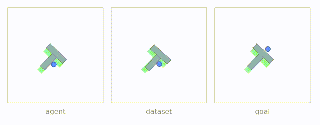
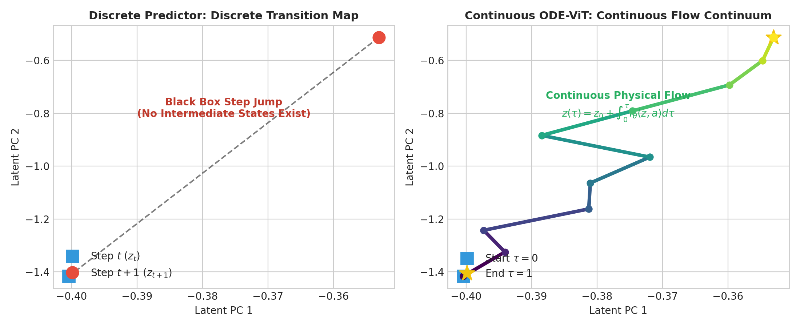

# Continuous-Time Predictors for JEPA World Models

[](https://www.python.org/downloads/)
[](https://pytorch.org/)
[](LICENSE)

We replace the transformer predictor of **[LeWorldModel (LeWM)](https://arxiv.org/abs/2603.19312)** with an **ODE-ViT** — a learned vector field $\dot z = f_\theta(z, a)$ integrated in time — and show that a continuous-time world model can plan as well as LeWM on PushT, with a fraction of the parameters, while gaining the structural benefits of continuous time.

<p align="center">
  
  <br><em>Autonomous MPC planning in PushT with the learned continuous ODE-ViT predictor.</em>
</p>

---

## Highlights

- **A continuous predictor that matches LeWM — with 4.8× fewer parameters:** On LeWM's frozen encoder, a 2.25M-parameter ODE-ViT reaches **90.0%** planning success against **87.75%** for LeWM's 10.8M transformer predictor ($n=400$, paired). It does so with a **single frame of context**, where the transformer attends over three.
- **Trains end-to-end from pixels, out of the box:** Dropped into LeWM's official training recipe as a minimal change, the ODE predictor trains stably with no representation collapse and matches the transformer at every checkpoint from epoch 10 to 100 ($n=200$ paired). We first reproduced LeWM's official checkpoint (**84.5% vs 82.0%**) to make the comparison exact.

<p align="center">
  
  <br><em>Sampled-data parity: Discrete vs continuous latent predictors across pixel-level training epochs.</em>
</p>

<p align="center">
  
  <br><em>What p = 0.38 looks like: the 200 paired episodes at epoch 100.</em>
</p>

- **One Euler step is enough:** The learned field is nearly straight within a control step (arc/chord ratio $= 1.005$, 99.5% straight), so planning success is unchanged from 1 to 16 integration steps. At inference the continuous model needs a single velocity evaluation per step.

<p align="center">
  
  <br><em>Flow invariance: Endpoints of N=1, 2, 4, 16 Euler integration steps coincide within 0.2% tolerance.</em>
</p>

- **Works with irregular frame rates:** Because the model integrates a vector field, it can predict across any time gap. Trained only on gaps of 1, 2, 3, 5 and 8 frames, it generalizes to unseen gaps (4, 6, 7, 9, 11, 15) with no loss in accuracy, composes predictions exactly across horizons, and can even integrate backward in time. A predictor that conditions directly on the time gap breaks down on the unseen gaps.
- **Graduated non-convexity makes gradient-based planning work:** Gradient planning on learned latent dynamics usually fails on contact-rich tasks: the cost landscape is full of flat regions and sharp jumps. Smoothing the learned vector field and annealing the smoothing to zero lifts gradient-based planning from **19% to 57%** ($p \approx 5 \times 10^{-22}$), on both continuous and discrete predictors. A derivative-free ensemble Kalman planner, which follows the same smoothed gradients from forward rollouts only, reaches **58.5%** without any backpropagation.
- **Faster planning with CEM:** Calibrating the search budget shows that 2,000 rollouts per replan match LeWM's default 9,000 (**85.0% vs 84.5%**), making planning about **3× faster** at the same success rate.

<p align="center">
  
  <br><em>Scaling frontier: CEM reaches 85% at 2,000 rollouts; the Hybrid CEM-EKI curve merges with standard CEM.</em>
</p>

---

## Why Continuous Time

A continuous predictor learns dynamics rather than a fixed-step transition: one vector field serves every time horizon, predictions compose exactly, the integration step is a choice made at inference, and the field is a smooth object that can be integrated, linearized or smoothed. 

<p align="center">
  
  <br><em>The continuous world model as a dynamical vector field: learned velocity streamlines $\dot z = f_\theta(z, a)$ in latent PCA space.</em>
</p>

<p align="center">
  
  <br><em>The nature of continuity: Dense physical continuum $z(\tau) = z_0 + \int_0^\tau f_\theta(z, a) d\tau$ vs black-box discrete step jumps.</em>
</p>

On PushT, with its fixed control rate, this matches the discrete model's accuracy — as theory predicts, since a flow held over one control step is itself a transition map:

$$z_{k+1} = \Phi_h^{f(\cdot, u_k)}(z_k) \quad \text{exactly.}$$

The advantages show up where time is not uniform (irregular or variable frame rates) and where the structure of the field is exploited directly, as graduated non-convexity does.

---

## Insights

- **Training recipe:** Supervising multi-step rollouts instead of single steps is the single largest improvement we measured (**20% → 74%** at the same model size).
- **Planning cost:** The encoder captures the full physical state, but latent distance to the goal image mostly tracks the pusher rather than the block — a clear target for better planning costs.

<p align="center">
  
</p>

- **Evaluation:** Small, unseeded evaluations can swing by over 10 points on the same checkpoint. All headline results use paired episodes and exact McNemar tests, and the end-to-end and planning-budget results use a fully deterministic evaluator.

<p align="center">
  
</p>

---

## Evaluation Protocol

- **Task:** PushT (`swm/PushT-v1`), goal 25 steps ahead, 50-step budget, frameskip 5, CEM planning by default.
- **Paired Comparisons:** Both models are always evaluated on the exact same initial conditions and goal states.
- **Statistical Rigor:** Evaluated with two-tailed exact McNemar tests on discordant pairs and 95% Wilson score confidence intervals.
- **Deterministic Harness:** The end-to-end and planning-budget results use a deterministic evaluator with an independent random stream per episode, making scores strictly reproducible across batch sizes and runs. The frozen-encoder, irregular-sampling and graduated-non-convexity results use an earlier paired, seeded harness. Per-episode outcomes are committed in `results/`.

---

## Repository Structure

```text
continuous-lewm/
├── cwm/
│   ├── models/           # ODE-ViT velocity predictor, discrete predictor, encoders
│   ├── solvers/          # cem.py, collocation.py (augmented Lagrangian), gnc.py,
│   │                     # ensemble_kalman.py (EKI + hybrid)
│   ├── eval/             # deterministic paired evaluator (per-environment streams)
│   └── analysis/         # statistics (McNemar, Wilson intervals)
├── configs/              # model, solver, and task configs
├── scripts/
│   ├── make_figures.py   # reproduces all markdown tables & statistics from results
│   └── generate_readme_figures.py # generates all high-DPI README plots
├── results/              # per-episode outcome JSONs for all 24+ configurations
└── assets/figures/       # high-resolution figures and animated GIFs
```

---

## Reproducing the Results

```bash
git clone https://github.com/marc-herrero/continuous-lewm.git && cd continuous-lewm
conda env create -f environment.yml && conda activate cwm

# Recompute every table, confidence interval, and p-value in seconds:
python scripts/make_figures.py --results results/

# Regenerate all README publication figures:
python scripts/generate_readme_figures.py
```

---

## Next Steps

1. **Non-integer timestamps and variable control rates:** Where integrating a vector field is the natural way to handle data that no fixed-step model can consume directly.
2. **Better planning costs:** That weight the manipulated object rather than the end effector.
3. **Combining graduated non-convexity with temporal straightening:** Attacking the non-convex planning landscape from both sides.

---

## Acknowledgements

Built on **[LeWorldModel](https://arxiv.org/abs/2603.19312)** and the `stable-worldmodel` library, with the PushT dataset from **[DINO-WM](https://arxiv.org/abs/2411.04983)**. The planning work draws on randomized smoothing through contact ([Suh, Pang & Tedrake](https://arxiv.org/abs/2109.05143)) and ensemble Kalman inversion ([Iglesias, Law & Stuart](https://arxiv.org/abs/1302.3585)). Related work on latent geometry: **[Temporal Straightening for Latent Planning](https://arxiv.org/abs/2603.12231)**.

```bibtex
@misc{herrero2026continuouslewm,
  title = {Continuous-Time Predictors for JEPA World Models},
  author = {Herrero, M.},
  year = {2026},
  note = {Bachelor's Thesis, Computer Vision Center (CVC)},
  url = {https://github.com/marc-herrero/continuous-lewm}
}
```

## License
MIT License — see [LICENSE](LICENSE).
